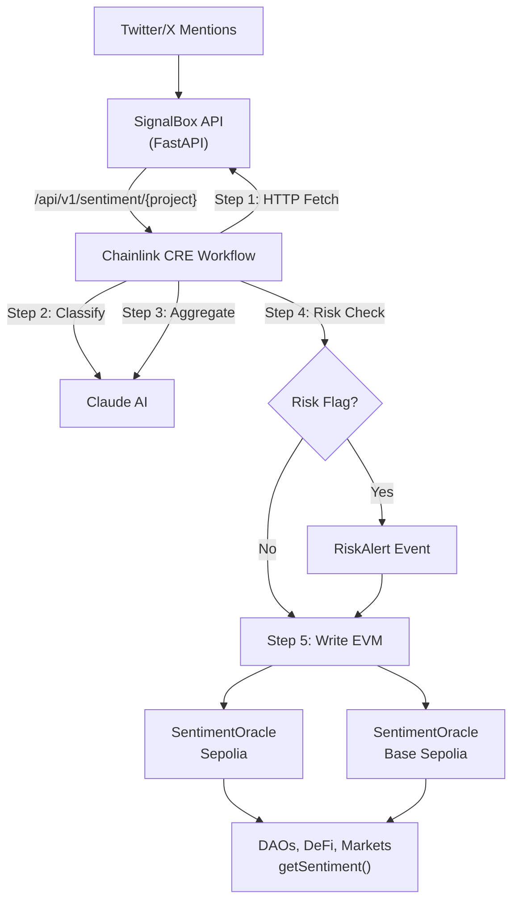

# SignalBox: On-Chain Social Sentiment Oracle

**Chainlink price feeds, but for community sentiment.**

SignalBox aggregates Twitter/X feedback about crypto projects, classifies each item using AI, assesses risk, and publishes verified sentiment scores on-chain via Chainlink CRE. DAOs, prediction markets, and DeFi protocols can consume this data for governance, risk management, and community-driven decisions.

**Chainlink Convergence Hackathon 2026**

| Track | Prize Pool |
|-------|-----------|
| CRE & AI | $33,500 |
| Risk & Compliance | $32,000 |
| Tenderly | $10,250 |

> All CRE workflow, smart contract, and dashboard code was built during the hackathon period (Feb 6 - Mar 8, 2026). Git history proves this.

## How It Works

```
Twitter/X mentions
       |
       v
  SignalBox API (FastAPI)
  Collects and aggregates community feedback
       |
       v
  /api/v1/sentiment/{project}
       |
       v
  Chainlink CRE Workflow v2 (TypeScript)
  +-----------------------------------------------+
  | 1. HTTP Fetch     - Pull aggregated feedback   |
  | 2. AI Classify    - Category, priority, bot %  |
  | 3. AI Aggregate   - Score, summary, risk flag  |
  | 4. Risk Check     - Conditional risk alerting  |
  | 5. Write EVM      - Publish verified report    |
  +-----------------------------------------------+
       |
       v
  SentimentOracle.sol (Sepolia + Base Sepolia)
  Cross-chain sentiment feed + risk alerts
       |
       v
  Any protocol can read:
  getSentiment("chainlink") => {score: 78, mentions: 8, ...}
```

## Live Demo

- **Dashboard**: [signalbox-4bmb.onrender.com/dashboard](https://signalbox-4bmb.onrender.com/dashboard) (first load may take ~30s)
- **Demo Video**: _Coming soon_
- **Sepolia Contract**: [`0xcA374e8bba8bd2BA0Aed26c4d425aA9aa7E058D0`](https://sepolia.etherscan.io/address/0xcA374e8bba8bd2BA0Aed26c4d425aA9aa7E058D0)
- **Base Sepolia Contract**: [`0x8e39631FBfAB68Ff5739F576847Ba7795f5b3AcE`](https://sepolia.basescan.org/address/0x8e39631FBfAB68Ff5739F576847Ba7795f5b3AcE)
- **E2E Transactions** (March 1, 2026 -- live CRE pipeline against Render API):

  | Project | Score | Sepolia TX Hash |
  |---------|-------|-----------------|
  | Chainlink | 78 | `0xeafb878a...1c7c9a1b` |
  | Uniswap | 68 | `0xac29cb9c...f162d402` |
  | Aave | 78 | `0x1e616081...fbd8fb99` |
  | Base | 72 | `0xac00081c...62da05b1` |
  | Arbitrum | 62 | `0x778e9d19...b58eb956` |
- **On-chain Scores** (verified via `cast call`): Chainlink 78, Aave 78, Base 72, Uniswap 68, Arbitrum 62

## What Makes This Different

Most oracles deliver price data. SignalBox delivers **sentiment data** -- a novel oracle type that captures what the community actually thinks about a project. This enables use cases that price feeds can't address:

- **DAO governance**: Weight proposals by community sentiment
- **Prediction markets**: Trade on social consensus shifts
- **Risk assessment**: Detect community frustration before it becomes a sell event
- **Protocol health**: Monitor bug reports and complaints in real-time

## CRE Workflow (v2)

The CRE workflow (`workflow/`) uses a multi-step AI pipeline that runs on Chainlink's Decentralized Oracle Network:

1. **HTTP Fetch** -- pulls aggregated community feedback from the SignalBox API
2. **AI Classification** (Claude) -- classifies each feedback item individually:
   - Category: `bug`, `feature_request`, `complaint`, `praise`, `question`
   - Priority: `high`, `medium`, `low`
   - Bot probability: 0-100 (filters spam/bots from scoring)
3. **AI Aggregation + Risk Assessment** (Claude) -- second AI call on classified data:
   - Overall sentiment score (0-100)
   - Natural language summary
   - Top 3 issues by engagement
   - Risk flag (score < 40, majority negative, or high-priority bugs)
4. **Conditional Risk** -- logs risk alerts when flagged (contract also detects score drops >= 15 points)
5. **Write EVM** -- publishes the verified report to `SentimentOracle.sol` via `writeReport`

The two-step AI approach (classify then aggregate) produces better scores than a single call because the aggregation model works on structured, classified data instead of raw text.

### Workflow Files

| File | Purpose |
|------|---------|
| `workflow/main.ts` | Entry point, registers HTTP trigger |
| `workflow/httpCallback.ts` | 5-step pipeline: fetch -> classify -> aggregate -> risk -> write |
| `workflow/claude.ts` | Two AI functions: `classifyFeedback` + `aggregateSentiment` |
| `workflow/workflow.yaml` | CRE staging/production config |
| `workflow/config.staging.json` | Chain config, contract address, API URL |

### CRE Capabilities Used

| Capability | How Used |
|------------|----------|
| HTTPClient | Fetch social data from SignalBox API |
| HTTPClient | Call Claude API for classification (step 2) |
| HTTPClient | Call Claude API for aggregation (step 3) |
| EVMClient | Write sentiment reports on-chain |
| Runtime.report() | ABI-encode reports for on-chain consumption |
| Runtime.getSecret() | Securely access API keys |
| consensusIdenticalAggregation | DON consensus on HTTP responses |

## Smart Contract

`SentimentOracle.sol` extends CRE's `ReceiverTemplate` to accept verified reports from the DON.

**Stores per project:**
- `score` (0-100) -- overall sentiment
- `totalMentions` -- feedback volume
- `positive` / `negative` / `neutral` -- category counts
- `summary` -- AI-generated natural language summary
- `timestamp` -- last update time

**Read functions:**
- `getSentiment(project)` -- latest data
- `getHistory(project, count)` -- historical scores
- `getTrackedProjects()` -- all monitored projects
- `getHistoryLength(project)` -- number of historical entries

**Events:**
- `SentimentUpdated(project, score, totalMentions, summary, timestamp)` -- every update
- `ProjectAdded(project)` -- new project tracked
- `RiskAlert(project, previousScore, newScore, dropSize, timestamp)` -- score drop >= 15 points

**Risk Detection:** The contract tracks previous scores per project. When a new report shows a drop of 15+ points, it emits `RiskAlert` -- enabling on-chain alerting systems to react to sudden sentiment crashes.

## Running Locally

### Prerequisites

- Node.js v20+
- Foundry (forge, cast)
- Bun v1.3+
- CRE CLI v1.0.10+
- Python 3.10+ (for API server)

### 1. Smart Contract

```bash
cd contracts
forge build
forge test  # 8 tests, all passing
```

### 2. API Server + Dashboard

```bash
cd src
pip install -r requirements.txt
DEMO_MODE=true python -m uvicorn app.main:app --port 8000
# API: http://localhost:8000
# Dashboard: http://localhost:8000/dashboard
```

In demo mode, the server serves curated data with realistic timestamps, category breakdowns, and AI summaries for 5 monitored projects. No external API keys needed. All responses include `"mode": "staging"` for transparency.

### 3. CRE Workflow Simulation

```bash
cd workflow
cp ../.env.example ../.env
# Set ANTHROPIC_API_KEY and CRE_ETH_PRIVATE_KEY in .env

# Run for a specific project (recommended: one project per invocation)
cre workflow simulate . -T staging-settings --broadcast \
  --non-interactive --trigger-index 0 --http-payload '{"project":"chainlink"}'

# Run all 5 projects
for p in chainlink uniswap aave base arbitrum; do
  cre workflow simulate . -T staging-settings --broadcast \
    --non-interactive --trigger-index 0 --http-payload "{\"project\":\"$p\"}"
done
```

> **Note:** The v2 pipeline uses 3 HTTP calls per project (fetch + classify + aggregate). CRE enforces a per-workflow HTTP call limit, so each invocation processes one project. For multi-project updates, trigger once per project.

### 4. Verify On-Chain

```bash
# Sepolia
cast call 0xcA374e8bba8bd2BA0Aed26c4d425aA9aa7E058D0 \
  "getSentiment(string)((uint8,uint32,uint32,uint32,uint32,string,uint256))" \
  "chainlink" \
  --rpc-url https://1rpc.io/sepolia

# Base Sepolia
cast call 0x8e39631FBfAB68Ff5739F576847Ba7795f5b3AcE \
  "getSentiment(string)((uint8,uint32,uint32,uint32,uint32,string,uint256))" \
  "chainlink" \
  --rpc-url https://base-sepolia-rpc.publicnode.com
```

## Tech Stack

| Component | Technology |
|-----------|------------|
| API Server | Python, FastAPI |
| CRE Workflow | TypeScript, Chainlink CRE SDK v1.0.9 |
| Smart Contract | Solidity ^0.8.24, Foundry |
| AI Classification | Claude Haiku 4.5 (step 2: classify items) |
| AI Aggregation | Claude Haiku 4.5 (step 3: score + risk) |
| Testnets | Ethereum Sepolia, Base Sepolia |
| ABI Encoding | viem (`encodeAbiParameters`) |
| Contract Base | CRE ReceiverTemplate, OpenZeppelin v5.5 |

## Project Structure

```
SignalBox/
+-- contracts/
|   +-- src/SentimentOracle.sol     # On-chain oracle with RiskAlert
|   +-- test/SentimentOracle.t.sol  # 8 Foundry tests
|   +-- script/Deploy.s.sol         # Deployment script
+-- workflow/
|   +-- main.ts                     # CRE entry point
|   +-- httpCallback.ts             # 5-step pipeline orchestration
|   +-- claude.ts                   # AI classify + aggregate functions
|   +-- workflow.yaml               # CRE config
|   +-- config.staging.json         # Chain + contract config
+-- src/app/
|   +-- main.py                     # FastAPI app (demo mode + production mode)
|   +-- routers/demo.py             # Demo data router (curated staging data)
|   +-- routers/sentiment.py        # Production sentiment API (DB-backed)
|   +-- routers/auth.py             # X OAuth login
|   +-- routers/feedback.py         # Feedback inbox API
|   +-- services/                   # Twitter, classifier, alerts, Telegram
|   +-- static/dashboard.html       # Sentiment dashboard
+-- render.yaml                     # Render deployment config
```

## API Endpoints

### `GET /api/v1/sentiment/{project}?period=1h`

Returns aggregated sentiment data for a project.

```json
{
  "project": "chainlink",
  "period": "1h",
  "mode": "staging",
  "score": 82,
  "total_mentions": 8,
  "breakdown": {
    "praise": 4,
    "feature_request": 1,
    "question": 1,
    "bug": 1,
    "complaint": 1
  },
  "ai_summary": "Community sentiment for Chainlink is strongly positive at 82/100...",
  "key_themes": ["CCIP adoption", "CRE developer experience", ...],
  "items": [...]
}
```

### `GET /api/v1/sentiment` -- Lists all monitored projects
### `GET /api/v1/history/{project}?days=7` -- Score history
### `GET /api/v1/comparison` -- Ranked project comparison
### `GET /api/v1/pipeline/runs` -- Recent CRE workflow runs
### `GET /api/v1/pipeline/status` -- Pipeline health + next run timer

## E2E Test Results (v2 Workflow)

Full multi-step pipeline executed successfully:

```
=== SignalBox Sentiment Oracle v2: HTTP Trigger ===
[Step 1] Fetching data for: chainlink
[Step 1] Got 8 mentions
[Step 2] Classifying feedback with Claude AI...
[Step 2] Classification: {"praise":4,"feature_request":1,"complaint":1,"question":1,"bug":1}
[Step 3] Aggregating sentiment + risk assessment...
[Step 3] Score: 78/100 | +4 -2 ~1 | risk=false
[Step 3] Top issues: CRE simulate error on M1 Mac; Documentation clarity needed; Solana support request
[Step 5] chainlink: score=78 risk=false chains=1/2
=== Sentiment Oracle v2 Update Complete ===
```

On-chain data verified (March 1, 2026):

| Project | Score | Mentions | Positive | Negative | Neutral |
|---------|-------|----------|----------|----------|---------|
| Chainlink | 78 | 8 | 4 | 2 | 1 |
| Aave | 78 | 6 | 4 | 1 | 0 |
| Base | 72 | 6 | 4 | 2 | 0 |
| Uniswap | 68 | 6 | 2 | 2 | 1 |
| Arbitrum | 62 | 6 | 3 | 2 | 1 |

## Data Source Strategy

**Hackathon (current):** Curated staging data that mirrors real social patterns. Responses labeled `"mode": "staging"` for transparency.

**Production roadmap:**
1. LunarCrush API ($30/month) -- aggregated social metrics for all crypto projects
2. Reddit API (free) -- subreddit monitoring for technical discussions
3. X API Basic ($100/month) -- direct tweet access when revenue justifies

## Architecture Diagram



## Deployed Contracts

| Network | Address | Explorer |
|---------|---------|----------|
| Sepolia | `0xcA374e8bba8bd2BA0Aed26c4d425aA9aa7E058D0` | [Etherscan](https://sepolia.etherscan.io/address/0xcA374e8bba8bd2BA0Aed26c4d425aA9aa7E058D0) |
| Base Sepolia | `0x8e39631FBfAB68Ff5739F576847Ba7795f5b3AcE` | [Basescan](https://sepolia.basescan.org/address/0x8e39631FBfAB68Ff5739F576847Ba7795f5b3AcE) |
| CRE Forwarder | `0x15fC6ae953E024d975e77382eEeC56A9101f9F88` | -- |
| Deployer | `0x043117bb026a4F8F4b3eC259511748208243B59a` | -- |

## Built For

Chainlink Convergence Hackathon 2026

**Tracks:** CRE & AI ($33.5K) | Risk & Compliance ($32K) | Tenderly ($10.25K)
