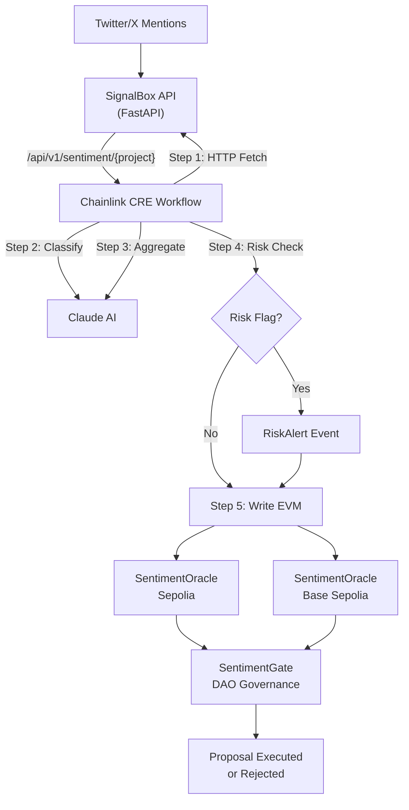

# SignalBox: On-Chain Social Sentiment Oracle

**Chainlink price feeds, but for community sentiment.**

SignalBox is a novel oracle that captures what crypto communities actually think. It aggregates social feedback, classifies it with AI, assesses risk, and publishes verified sentiment scores on-chain via Chainlink CRE. Any protocol can read `getSentiment("chainlink")` and gate actions on community health.

## Live Demo

| Resource | Link |
|----------|------|
| Dashboard | [yonkoo11.github.io/SignalBox](https://yonkoo11.github.io/SignalBox/) |
| Demo Video | _Coming soon_ |
| Sepolia Oracle | [`0xcA37...58D0`](https://sepolia.etherscan.io/address/0xcA374e8bba8bd2BA0Aed26c4d425aA9aa7E058D0) |
| SentimentGate Consumer | [`0x63e7...9cA5`](https://sepolia.etherscan.io/address/0x63e743Ec4FA388f7A3383ebE8873da2d38cB9cA5) |
| SentimentSentinel | [`0x6090...a19e`](https://sepolia.etherscan.io/address/0x6090633D3C8041B0555E3a6565A11898214ea19e) |
| Automation Upkeep | [View Upkeep](https://automation.chain.link/sepolia/63951953480945797395994495867330998017254415204292776530584090000110353892946) |

**Hackathon:** Chainlink Convergence 2026 | **Tracks:** CRE & AI ($33.5K) | Risk & Compliance ($32K) | Tenderly ($10.25K)

> All code built during hackathon period (Feb 6 - Mar 8, 2026). Git history proves it.

---

## How It Works

```
Twitter/X mentions
       |
       v
  SignalBox API (FastAPI)
  Collects + aggregates community feedback
       |
       v
  Chainlink CRE Workflow (TypeScript, 5-step pipeline)
  +-----------------------------------------------+
  | 1. HTTP Fetch     - Pull aggregated feedback   |
  | 2. AI Classify    - Category, priority, bot %  |
  | 3. AI Aggregate   - Score, summary, risk flag  |
  | 4. Risk Check     - Conditional risk alerting  |
  | 5. Write EVM      - Publish verified report    |
  +-----------------------------------------------+
       |
       v
  SentimentOracle.sol (Sepolia + Base Sepolia)
  Cross-chain sentiment feed + risk alerts
       |
       v
  SentimentGate.sol (Consumer Contract)
  Gates DAO proposals by community sentiment
```

## What Makes This Different

Most oracles deliver price data. SignalBox delivers **sentiment data** -- a novel oracle type that captures what the community actually thinks about a project. This creates new on-chain primitives:

- **DAO governance**: Gate proposal execution on community sentiment (see SentimentGate below)
- **Risk assessment**: Detect community frustration before it becomes a sell event
- **Prediction markets**: Trade on social consensus shifts
- **Protocol health**: Monitor bug reports and complaints in real-time

---

## Consumer Contract: SentimentGate

SentimentGate demonstrates real downstream consumption of oracle data. It gates DAO governance proposals based on community sentiment health.

```solidity
// Create a proposal linked to a project's sentiment
gate.createProposal("chainlink", "Upgrade oracle feed frequency", targetContract, callData);

// Only executes if sentiment >= threshold AND data is fresh
gate.executeProposal(0);
// Reverts with SentimentTooLow(30, 50) if community is unhappy
// Reverts with SentimentDataStale(7201, 7200) if data is old

// Check before executing
(bool canExecute, uint8 score, string memory reason) = gate.checkProposal(0);
```

**How it works:**
1. Owner creates a proposal tied to a project's sentiment
2. Before execution, the contract reads `SentimentOracle.getSentiment(project)`
3. Checks: score >= threshold (configurable) AND data age < freshness window
4. If both pass, executes the proposal's target call. If not, reverts with a specific error.

**31 tests passing** (11 SentimentGate + 8 SentimentOracle):
```bash
cd contracts && forge test
```

---

## CRE Workflow

The CRE workflow (`workflow/`) runs a multi-step AI pipeline on Chainlink's Decentralized Oracle Network:

1. **HTTP Fetch** -- pulls aggregated community feedback from SignalBox API
2. **AI Classification** (Claude Haiku) -- classifies each feedback item:
   - Category: `bug`, `feature_request`, `complaint`, `praise`, `question`
   - Priority: `high`, `medium`, `low`
   - Bot probability: 0-100 (filters spam from scoring)
3. **AI Aggregation + Risk Assessment** (Claude Haiku) -- second AI call on classified data:
   - Overall sentiment score (0-100)
   - Natural language summary
   - Top 3 issues by engagement
   - Risk flag (score < 40, majority negative, or high-priority bugs)
4. **Conditional Risk** -- logs risk alerts when flagged (contract also detects score drops >= 15 points)
5. **Write EVM** -- publishes verified report to `SentimentOracle.sol` via `writeReport`

The two-step AI approach (classify then aggregate) produces better scores than a single call because the aggregation model works on structured, classified data instead of raw text.

### CRE Capabilities Used

| Capability | Usage |
|------------|-------|
| HTTPClient | Fetch social data from SignalBox API |
| HTTPClient | Call Claude API for classification (step 2) |
| HTTPClient | Call Claude API for aggregation (step 3) |
| EVMClient | Write sentiment reports on-chain |
| Runtime.report() | ABI-encode reports for on-chain consumption |
| Runtime.getSecret() | Securely access API keys |
| consensusIdenticalAggregation | DON consensus on HTTP responses |

### Workflow Files

| File | Purpose |
|------|---------|
| `workflow/main.ts` | Entry point, registers HTTP trigger |
| `workflow/httpCallback.ts` | 5-step pipeline: fetch -> classify -> aggregate -> risk -> write |
| `workflow/claude.ts` | Two AI functions: `classifyFeedback` + `aggregateSentiment` |
| `workflow/workflow.yaml` | CRE staging/production config |
| `workflow/config.staging.json` | Chain config, contract address, API URL |

---

## Smart Contracts

### SentimentOracle.sol

Extends CRE's `ReceiverTemplate` to accept verified reports from the DON.

**Stores per project:**
- `score` (0-100), `totalMentions`, `positive` / `negative` / `neutral` counts
- `summary` -- AI-generated natural language summary
- `timestamp` -- last update time

**Read functions:**
- `getSentiment(project)` -- latest data
- `getHistory(project, count)` -- historical scores
- `getTrackedProjects()` -- all monitored projects

**Events:**
- `SentimentUpdated` -- every update
- `ProjectAdded` -- new project tracked
- `RiskAlert` -- score drop >= 15 points (enables on-chain alerting)

### SentimentGate.sol

Consumer contract that reads from SentimentOracle. See [Consumer Contract](#consumer-contract-sentimentgate) above.

### SentimentSentinel.sol (Chainlink Automation)

Monitors oracle data freshness using Chainlink Automation. When any tracked project's sentiment data is older than the staleness threshold, Automation nodes detect this via `checkUpkeep` and call `performUpkeep` to emit a `StaleDataAlert` event on-chain.

**Two Chainlink services working together:** CRE pushes data in, Automation monitors data health.

- Configurable staleness threshold and alert cooldown
- Re-validates conditions in `performUpkeep` (Chainlink best practice)
- Register as Custom Logic upkeep at [automation.chain.link](https://automation.chain.link/sepolia)

---

## E2E Results (March 1, 2026)

Full CRE pipeline executed against live Render API, verified on-chain:

| Project | Score | Mentions | +/- | Sepolia TX |
|---------|-------|----------|-----|------------|
| Chainlink | 78 | 8 | +4 -2 | `0xeafb878a...1c7c9a1b` |
| Aave | 78 | 6 | +4 -1 | `0x1e616081...fbd8fb99` |
| Base | 72 | 6 | +4 -2 | `0xac00081c...62da05b1` |
| Uniswap | 68 | 6 | +2 -2 | `0xac29cb9c...f162d402` |
| Arbitrum | 62 | 6 | +3 -2 | `0x778e9d19...b58eb956` |

---

## Running Locally

### Prerequisites

- Node.js v20+, Bun v1.3+, Foundry, CRE CLI v1.0.10+, Python 3.10+

### 1. Smart Contracts

```bash
cd contracts
forge build
forge test  # 31 tests, all passing
```

### 2. Deploy SentimentGate (Sepolia)

```bash
cd contracts
cp .env.example .env  # Fill in PRIVATE_KEY, SEPOLIA_RPC_URL, ETHERSCAN_API_KEY
source .env
forge script script/DeployGate.s.sol:DeployGateScript \
  --rpc-url $SEPOLIA_RPC_URL \
  --private-key $PRIVATE_KEY \
  --broadcast --verify --etherscan-api-key $ETHERSCAN_API_KEY
```

### 3. API Server + Dashboard

```bash
cd src
pip install -r requirements.txt
DEMO_MODE=true python -m uvicorn app.main:app --port 8000
# API: http://localhost:8000
# Dashboard: http://localhost:8000/dashboard
```

In demo mode, the server serves curated data with realistic timestamps, category breakdowns, and AI summaries for 5 monitored projects. No external API keys needed. All responses include `"mode": "staging"` for transparency.

### 4. CRE Workflow Simulation

```bash
cd workflow
# Set ANTHROPIC_API_KEY and CRE_ETH_PRIVATE_KEY in .env

# Run for a specific project
cre workflow simulate . -T staging-settings --broadcast \
  --non-interactive --trigger-index 0 --http-payload '{"project":"chainlink"}'

# Run all 5 projects
for p in chainlink uniswap aave base arbitrum; do
  cre workflow simulate . -T staging-settings --broadcast \
    --non-interactive --trigger-index 0 --http-payload "{\"project\":\"$p\"}"
done
```

### 5. Verify On-Chain

```bash
cast call 0xcA374e8bba8bd2BA0Aed26c4d425aA9aa7E058D0 \
  "getSentiment(string)((uint8,uint32,uint32,uint32,uint32,string,uint256))" \
  "chainlink" --rpc-url https://1rpc.io/sepolia
```

---

## Architecture



## Tech Stack

| Component | Technology |
|-----------|------------|
| API Server | Python, FastAPI |
| CRE Workflow | TypeScript, Chainlink CRE SDK v1.0.9 |
| Smart Contracts | Solidity ^0.8.24, Foundry (31 tests) |
| AI Classification | Claude Haiku 4.5 (classify + aggregate) |
| Consumer Contract | SentimentGate.sol (governance gating) |
| Automation | SentimentSentinel.sol (staleness monitoring) |
| Testnets | Ethereum Sepolia, Base Sepolia |
| Dashboard | Vanilla HTML/CSS/JS (multi-page SPA) |
| Deployment | Render (API), GitHub Pages (dashboard) |

## Project Structure

```
SignalBox/
+-- contracts/
|   +-- src/SentimentOracle.sol     # On-chain oracle with RiskAlert
|   +-- src/SentimentGate.sol       # Consumer: DAO governance gating
|   +-- src/SentimentSentinel.sol   # Automation: oracle health monitoring
|   +-- test/SentimentOracle.t.sol  # 8 oracle tests
|   +-- test/SentimentGate.t.sol    # 11 consumer tests
|   +-- test/SentimentSentinel.t.sol # 12 automation tests
|   +-- script/Deploy.s.sol         # Oracle deployment
|   +-- script/DeployGate.s.sol     # Consumer deployment
|   +-- script/DeploySentinel.s.sol # Sentinel deployment
+-- workflow/
|   +-- main.ts                     # CRE entry point
|   +-- httpCallback.ts             # 5-step pipeline orchestration
|   +-- claude.ts                   # AI classify + aggregate functions
|   +-- workflow.yaml               # CRE config
|   +-- config.staging.json         # Chain + contract config
+-- src/app/
|   +-- main.py                     # FastAPI app (demo + production)
|   +-- routers/demo.py             # Demo data router
|   +-- routers/sentiment.py        # Production sentiment API
|   +-- static/dashboard.html       # Multi-page sentiment dashboard
+-- render.yaml                     # Render deployment config
```

## API Endpoints

| Endpoint | Description |
|----------|-------------|
| `GET /api/v1/sentiment/{project}?period=1h` | Aggregated sentiment for a project |
| `GET /api/v1/sentiment` | List all monitored projects |
| `GET /api/v1/history/{project}?days=7` | Score history |
| `GET /api/v1/comparison` | Ranked project comparison |
| `GET /api/v1/pipeline/runs` | Recent CRE workflow runs |
| `GET /api/v1/pipeline/status` | Pipeline health + next run timer |

## Deployed Contracts

| Network | Contract | Address |
|---------|----------|---------|
| Sepolia | SentimentOracle | [`0xcA374e8bba8bd2BA0Aed26c4d425aA9aa7E058D0`](https://sepolia.etherscan.io/address/0xcA374e8bba8bd2BA0Aed26c4d425aA9aa7E058D0) |
| Sepolia | SentimentGate | [`0x63e743Ec4FA388f7A3383ebE8873da2d38cB9cA5`](https://sepolia.etherscan.io/address/0x63e743Ec4FA388f7A3383ebE8873da2d38cB9cA5) |
| Sepolia | SentimentSentinel | [`0x6090633D3C8041B0555E3a6565A11898214ea19e`](https://sepolia.etherscan.io/address/0x6090633D3C8041B0555E3a6565A11898214ea19e) |
| Sepolia | Automation Upkeep | [View on Chainlink](https://automation.chain.link/sepolia/63951953480945797395994495867330998017254415204292776530584090000110353892946) |
| Sepolia | CRE Forwarder | `0x15fC6ae953E024d975e77382eEeC56A9101f9F88` |
| Base Sepolia | SentimentOracle | [`0x8e39631FBfAB68Ff5739F576847Ba7795f5b3AcE`](https://sepolia.basescan.org/address/0x8e39631FBfAB68Ff5739F576847Ba7795f5b3AcE) |

## Data Source Strategy

**Hackathon (current):** Curated staging data that mirrors real social patterns. All responses labeled `"mode": "staging"` for transparency.

**Production roadmap:**
1. LunarCrush API -- aggregated social metrics for all crypto projects
2. Reddit API -- subreddit monitoring for technical discussions
3. X API -- direct tweet access when revenue justifies cost

---

Built for **Chainlink Convergence Hackathon 2026**
